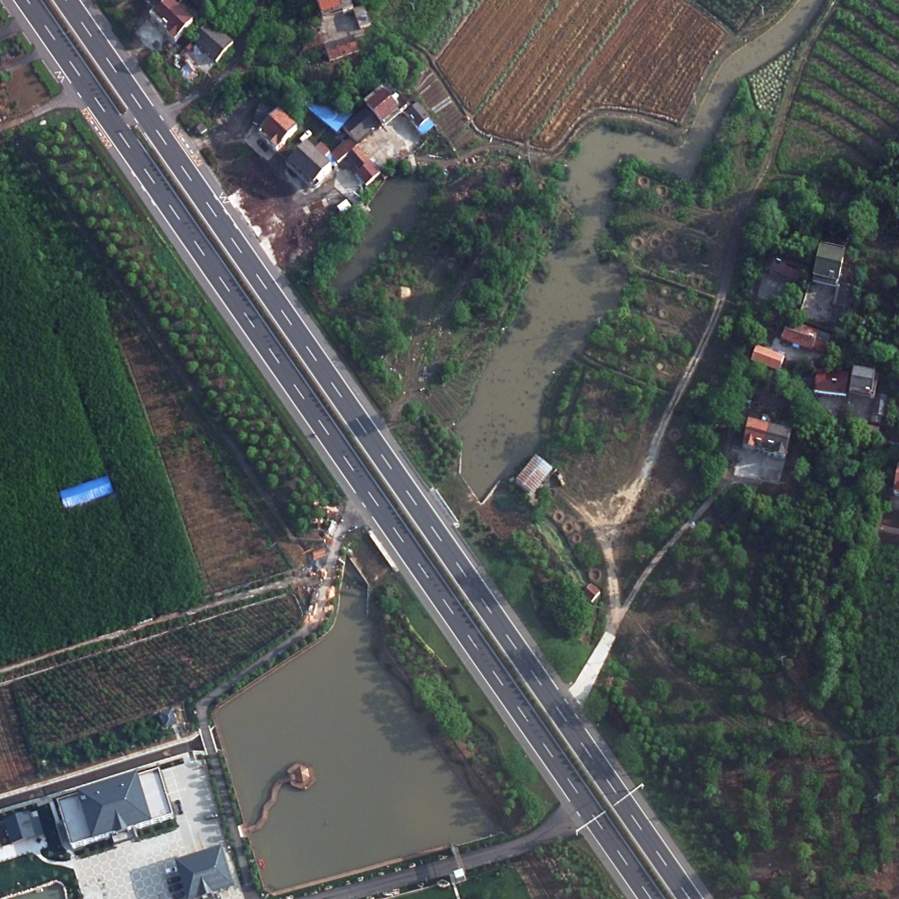

# Semantic Segmentation and Domain Adaptation for LoveDA Dataset
This Code Developed as Final Project of Advanced Machine Learning Course by: Ali Abbasi, Sarvnaz Roumianfar, Negin Meyhami

## Project Overview
This project explores semantic segmentation and domain adaptation techniques on the LoveDA dataset, which consists of rural and urban images for land cover classification. The project is divided into three stages, encompassing testing segmentation networks, addressing domain shift, and applying domain adaptation techniques. Each stage is aimed at improving segmentation accuracy and understanding the challenges associated with domain shift and adaptation in real-world scenarios.

## Table of Contents
1. [Dataset](#dataset)
2. [Stages and Results](#stages-and-results)
   - [Step 2: Testing Semantic Segmentation Networks](#step-2-testing-semantic-segmentation-networks)
   - [Step 3: Domain Shift](#step-3-domain-shift)
   - [Step 4: Domain Adaptation](#step-4-domain-adaptation)
3. [Comparison of Results](#comparison-of-results)
   - [Loss Comparison](#loss-comparison)
   - [mIoU Comparison](#miou-comparison)
   - [Prediction Comparison](#prediction-comparison)

---

## Dataset

The LoveDA dataset consists of urban and rural land cover images for semantic segmentation tasks. The dataset includes multiple semantic categories such as:
- Background
- Building
- Road
- Water
- Barren
- Forest
- Agriculture

### Dataset Splits
- **LoveDA-urban**: Urban imagery dataset used in training and evaluation.
- **LoveDA-rural**: Rural imagery dataset used for domain shift analysis and testing.

---

## Stages and Results

### Step 2: Testing Semantic Segmentation Networks

#### 2a: Classic Semantic Segmentation Network
- **Model**: DeepLabV2 with ResNet-101 (R101) backbone pre-trained on ImageNet.
- **Training Dataset**: LoveDA-rural dataset.
- **Validation Dataset**: LoveDA-rural dataset.

#### 2b: Real-Time Semantic Segmentation Network
- **Model**: PIDNet-S pre-trained on ImageNet.
- **Training Dataset**: LoveDA-rural dataset.
- **Validation Dataset**: LoveDA-rural dataset.

### Step 3: Domain Shift
#### 3a: Evaluating the Domain Shift Problem in Semantic Segmentation
- **Objective**: Train on LoveDA-urban (source domain) and evaluate on LoveDA-rural (target domain).
- **Model**: Real-time segmentation network trained without domain adaptation.
- **Training Dataset**: LoveDA-urban dataset.
- **Validation Dataset**: LoveDA-rural dataset.

#### 3b: Data Augmentations to Reduce Domain Shift
- **Objective**: Improve model robustness and reduce domain shift impact during training.
- **Model**: Real-time segmentation network trained without domain adaptation and with Augmentations.
- **Training Dataset**: LoveDA-urban dataset.
- **Validation Dataset**: LoveDA-rural dataset.

### Step 4: Domain Adaptation
#### 4a: Adversarial Approach
- **Technique**: Adversarial training using the best data augmentation settings from Step 3b.
- **Training Dataset**: LoveDA-urban dataset.
- **Validation Dataset**: LoveDA-rural dataset.

#### 4b: Image-to-Image Approach
- **Technique**: Implement image-to-image adaptation using DACS using the best data augmentation settings from Step 3b.
- **Training Dataset**: LoveDA-urban dataset.
- **Validation Dataset**: LoveDA-rural dataset.

---

## Comparison of Results

### Loss Comparison
Below are the Training loss & Validation loss curves for each step:
1. **Step 2a**: Classic segmentation network.
2. **Step 2b**: Real-time segmentation network.
3. **Step 3a**: Domain shift evaluation.
4. **Step 3b**: Domain shift with augmentations.
5. **Step 4**: Domain adaptation techniques.

*(Include corresponding loss graph images for each step)*

### mIoU Comparison
Below are the mIoU comparisons for each step:
1. **Step 2a**: Classic segmentation network.
2. **Step 2b**: Real-time segmentation network.
3. **Step 3a**: Domain shift evaluation.
4. **Step 3b**: Domain shift with augmentations.
5. **Step 4**: Domain adaptation techniques.

*(Include corresponding mIoU graph images for each step)*

### Prediction Comparison
Below are visual comparisons of predictions for each step:
1. **Step 2a**: Classic segmentation network.
2. **Step 2b**: Real-time segmentation network.
3. **Step 3a**: Domain shift evaluation.
4. **Step 3b**: Domain shift with augmentations.
5. **Step 4**: Domain adaptation techniques.

---

  
  
Image

  
  
PIDNet

  
  
Domain Shift

  
  
Augmentation

  
  
Adversarial

---

## References
1. LoveDA Dataset: [https://github.com/Junjue-Wang/LoveDA](https://github.com/Junjue-Wang/LoveDA)
3. PIDNet: [https://github.com/XuJiacong/PIDNet/](https://github.com/XuJiacong/PIDNet/)
4. ImageNet: [https://www.image-net.org/](https://www.image-net.org/)
5. DACS: [https://github.com/vikolss/DACS](https://github.com/vikolss/DACS)

